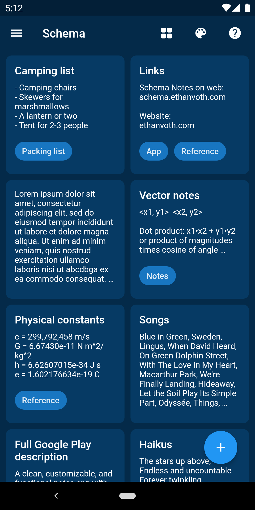
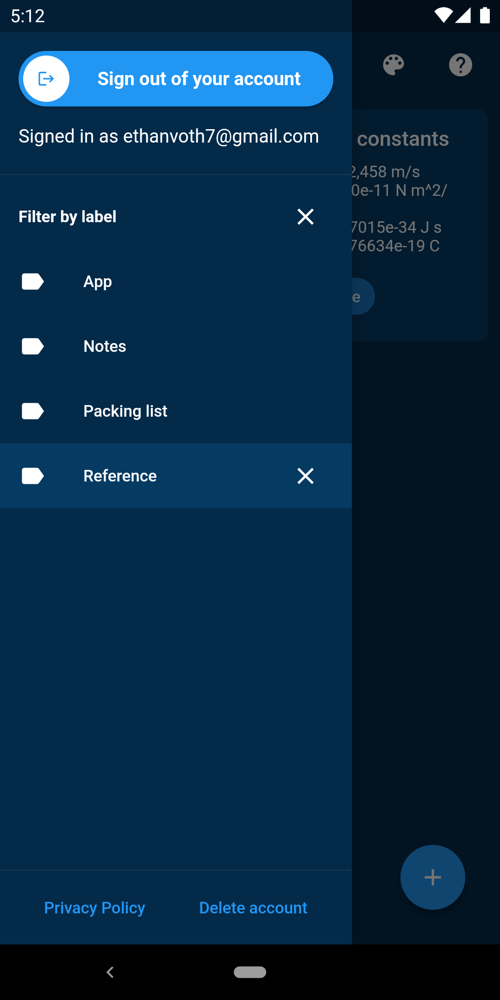
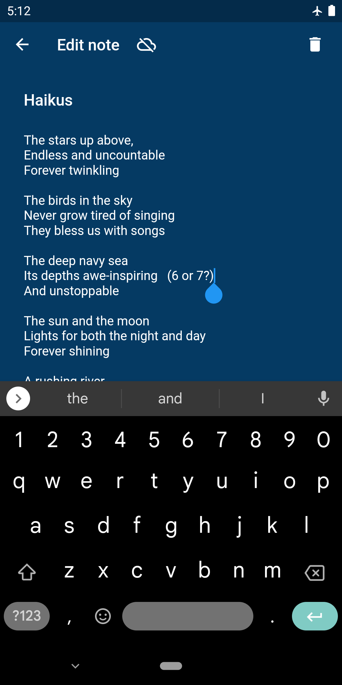
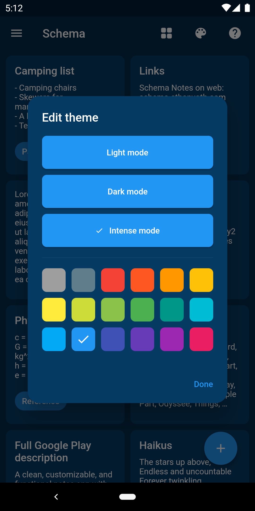

# Schema Notes
A clean, customizable, and functional notes app with support for note organization, offline use, and real-time syncing across multiple devices.

## Features
- Clean, simple, and customizable design
- Arrange notes in any order
- Easily organize notes using labels
- Keep editing notes without connection
- Many options to make your theme
- Real-time sync across devices
- Web app available at https://schema.ethanvoth.com

## Screenshots

## To-Do
- "Intense mode" for light mode and a darker dark mode option
- Lazy loading
- Add features like checklists, rich text, etc.